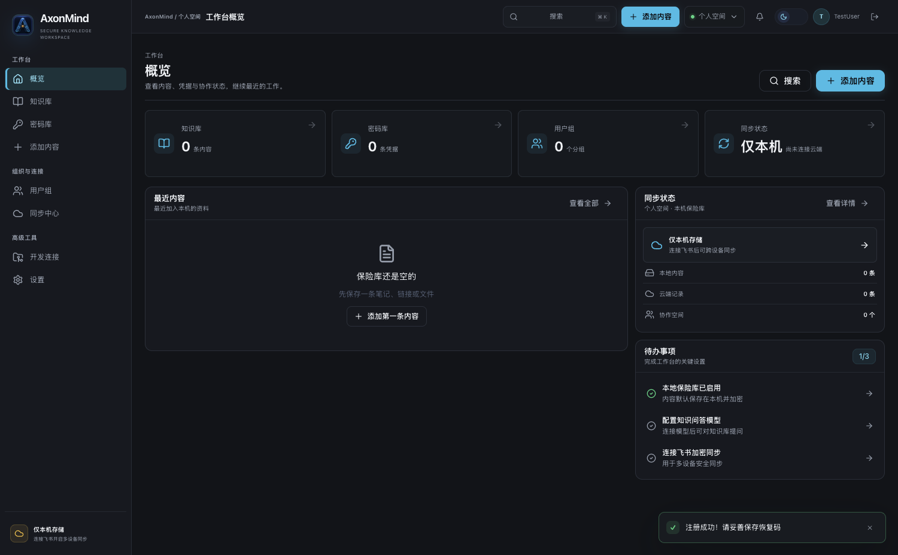

# AxonMind

[](LICENSE)
[](https://www.electronjs.org/)
[](https://nodejs.org/)

**AxonMind** 是一款面向个人与小型研发团队的本地优先安全知识与凭据工作台。它把文档、密钥、链接与项目上下文集中管理，支持**端到端加密**同步到飞书云盘，并通过本地全文检索与 AI 对话快速找到所需内容。

> 数据默认留在本机 SQLite；上云内容经 AES-256-GCM 加密，服务端（飞书）无法读取明文。

产品边界、核心流程和迭代路线见 [产品与工程规划](docs/PROJECT_PLAN.md)。



新用户可直接阅读[完整使用指南](docs/USER_GUIDE.md)。截图来自真实桌面应用的空白本地账户；界面示意图位于 `docs/design/`，不代表内置示例数据。

---

## 为什么选择 AxonMind

| 场景 | AxonMind 能做什么 |
|------|-------------------|
| 密码 / API Key / 证书 | 本地加密保存，可选同步到飞书保险箱 |
| 团队共享文档与密钥 | 用户组 + 组密钥，组员可见、个人空间仍隔离 |
| 多设备使用 | 同一飞书账号绑定稳定 Vault ID，设备列表、加密内容和删除状态协同同步 |
| 知识分散在多处 | 统一搜索本地库，并连接远程 KB / 向量库 / Obsidian |
| 日常开发 | 管理 Git/SVN 仓库与 Token，在应用内执行常用命令 |

---

## 功能特性

### 身份与安全

- 本地账号注册 / 登录（邮箱或手机号）
- 恢复码找回本地密码
- **双口令模型**
  - **本地登录密码**：解锁本机 SQLite 中的内容
  - **飞书加密口令**：加密/解密上传到云端的 `.axonvault` 文件（不上传、不存储于云端）

### 内容库（个人 / 用户组）

- 支持类型：文件、文本、密钥、网页链接、视频链接
- 顶栏切换上下文：**个人** 或 **某一用户组**
- 个人内容默认不共享；可「复制到组」生成组内副本
- 本地 **FTS** 全文检索（标题与标签）

### 用户组协作

- 创建组、按邮箱邀请成员（须已在本应用注册）
- 登录后自动接受待处理邀请
- 角色：所有者 / 管理员 / 成员 / 只读
- 移除成员、轮换组密钥、调整角色

### 飞书云同步

- OAuth 登录飞书
- 单文件加密上传（当前约 **18MB** 单文件上限）
- **单账号多端协同**：主设备创建云端账号，新设备加入已有账号；各电脑保留独立本地解锁密码
- **设备分片 manifest v3**：每台电脑独立写入加密清单，避免同时同步时互相覆盖，并保留 Vault 归属校验与删除墓碑
- 自动双向同步：登录、启动、本机修改和定时任务都会执行拉取、合并、内容上传与设备心跳；离线后自动重试
- 可配置同步间隔、设备名称、内容自动落地范围，以及“最新 / 本机 / 云端 / 手动”四种并发冲突策略
- 默认自动下载并解密其他设备新增的实际内容，本地添加的内容无需再次手动下载

### 知识检索与对话

- 配置 OpenAI-compatible / Claude 等大模型
- 连接远程知识库、向量库、Obsidian Local REST API
- 提问时 **优先检索本地库**，再聚合远程证据并由 LLM 生成回答

### 项目管理

- 保存 GitHub / GitLab / Git / SVN 账号（加密存储）
- 仓库配置与 clone、status、log、pull、commit、push 等快捷操作

---

## 快速开始

### 下载正式版

前往 [GitHub Releases](https://github.com/acid1030/vaultmind/releases) 下载最新版。当前自动发布流程提供 **macOS Apple Silicon（ARM64）DMG/ZIP**；Windows 与 Linux 暂无经过验证的正式安装包。未签名的 macOS 安装包可能出现系统安全提示，请核对下载来源和发布说明。

### 从源码运行

需要 Node.js 22、npm，以及 macOS / Windows / Linux 桌面环境。从源码运行不等于这些平台均有正式安装包。

```bash
git clone https://github.com/acid1030/vaultmind.git
cd vaultmind
npm ci
npm ci --prefix ui
npm run build:ui
npm start
```

第一次使用时先在应用内创建本地账户并保存恢复码；默认内容只保存在本机，不需要飞书或 AI 配置。后续操作参见[使用指南](docs/USER_GUIDE.md)。应用会从正式 Release 的更新元数据检查新版本，并在「设置 → 版本更新」中显示下载和安装进度。

### 发布新版本

1. 更新 `package.json` 中的版本号并提交代码。
2. 创建与版本一致的标签，例如 `git tag v0.4.0`。
3. 推送标签：`git push origin v0.4.0`。
4. GitHub Actions 自动测试、构建 macOS ARM64 DMG/ZIP，并发布到 GitHub Releases。请在工作流完成且产物可下载后再对外宣告发布成功。

客户端只读取 `acid1030/vaultmind` 的正式 Release；草稿和预发布版本不会自动推送给用户。

当前GitHub Actions默认发布未签名的DMG/ZIP，用户可以从Releases手动下载安装，但macOS可能显示未认证开发者提示。要启用macOS静默自动安装，需要Apple Developer ID证书：在GitHub仓库中配置`CSC_LINK`和`CSC_KEY_PASSWORD`两个Actions Secret，并将它们加入发布工作流构建步骤的`env`后再发布。

### 运行测试

```bash
npm test
```

测试覆盖：用户组邀请入组、组密钥加解密、邀请密封、FTS 搜索、manifest 合并、密钥轮换等核心逻辑。

多设备及打包应用验证：

```bash
npm run test:sync
npm run package:mac
npm run test:package
```

---

## 三种同步接入方式

在「配置 → 飞书同步」中选择适合自己的方式：

- **AxonMind 托管（推荐）**：用户无需创建飞书应用，只需登录并授权。此模式依赖官方托管 OAuth 服务；未配置服务的构建会明确显示“等待上线”，不会伪装成可用。
- **个人自建**：个人或技术用户使用自己的飞书自建应用，数据仍保存在自己的飞书云盘。
- **企业自建**：由企业管理员创建和管理内部应用，统一控制权限与凭据，适合组织部署。

### 个人/企业自建配置

1. 在 [飞书开放平台](https://open.feishu.cn/app) 创建**企业自建应用**。
2. 在「安全设置」中添加 OAuth 重定向 URL：

   ```text
   http://127.0.0.1:37891/feishu/oauth/callback
   ```

3. 开通建议权限：

   - `drive:drive`
   - `drive:drive:readonly`
   - `auth:user.id:read`
   - `wiki:wiki:readonly`（飞书知识库 Wiki 检索）

4. 在 AxonMind「配置 → 飞书同步」中选择**个人自建**或**企业自建**，填写 **App ID**、**App Secret**，保存后登录飞书。

可选：为某个用户组单独配置 **飞书文件夹 Token**，组内同步文件会写入该目录。

---

## 典型工作流

```text
1. 注册本地账号并登录
2. 选择同步接入方式 → 登录飞书 → 设置相同的端到端加密口令
3. 主设备在「同步中心」创建云端账号；其他电脑使用同一邮箱建立本机登录，再选择「加入已有账号」
4. 顶栏选择「个人空间」或某个用户组
5. 从左侧导航进入「添加内容」录入资料；开启自动双向同步后，无需手动执行上传
6. 另一台在线设备会自动合并并落地内容；也可在同步中心点击「完整同步」立即刷新
7. 使用全局搜索或知识对话查找信息
```

### 邀请同事加入用户组

1. 「用户组」→ 创建组  
2. 填写对方**已注册**的邮箱 → 发送邀请  
3. 对方用**相同邮箱**登录后会自动入组  

### 成员离职

1. 在用户组中 **移除成员**  
2. 执行 **轮换组密钥**（重加密组内数据）  
3. 对仍需访问的成员 **重新邀请**  

---

## 项目结构

```text
vaultmind/
├── src/
│   ├── main.js              # Electron 主进程、IPC、飞书 API
│   ├── preload.js           # 安全桥接
│   ├── core/
│   │   ├── schema.js        # 数据库迁移
│   │   ├── groups.js        # 用户组与成员
│   │   ├── group-crypto.js  # 组密钥加解密
│   │   ├── invite-crypto.js # 邀请密封
│   │   ├── search.js        # FTS 索引与搜索
│   │   ├── manifest-sync.js # 目录清单同步
│   │   ├── cloud-account.js # 云端账号与设备资料
│   │   └── feishu-drive.js  # 飞书文件列表解析
│   ├── services/            # 数据库、会话与加密服务
│   └── renderer/            # Vite 构建后的 Electron 界面
├── ui/                      # React + TypeScript 界面源码与 E2E
│   └── src/
│       ├── pages/           # 工作台与功能页面
│       ├── components/      # 通用及项目组件
│       ├── store/           # Zustand 应用状态
│       └── lib/             # IPC 类型桥接与工具
├── docs/
│   └── PROJECT_PLAN.md      # 产品边界、架构原则与路线图
├── scripts/
│   └── test-core.js         # 核心逻辑单元测试
├── package.json
└── README.md
```

本地数据库路径（Electron `userData`）：`secure-vault.sqlite`（应用内可打开所在目录）。

---

## 安全说明

- **端到端加密**：飞书上仅存密文；加密口令仅在你输入时用于加解密，不会上传。
- **组密钥**：组内内容使用独立的组密钥；成员通过 wrapped key 获得解密能力。
- **无法恢复的情况**：若忘记本地密码、飞书加密口令，或轮换密钥后未重新邀请成员，对应密文**无法找回**。
- **建议**：妥善保存恢复码；敏感生产密钥优先放在个人空间，再按需复制到组。
- **多端模型**：飞书 OAuth 用于确认同一云端身份，飞书加密口令用于解密云端资料；每台电脑的本地密码可以不同。
- **数据可靠性**：数据库采用原子写入并每 6 小时生成滚动备份；可在「设置 → 数据安全」中手动备份或恢复。
- **本机防护**：敏感内容复制后 30 秒自动清空剪贴板，连续登录失败会临时限流，空闲 30 分钟自动锁定。
- **macOS 会话**：正式安装包关闭应用后需要重新输入本地密码，避免系统钥匙串锁定时阻塞应用启动；同一账号的其他在线设备不会因此退出。
- **品牌迁移**：0.4.0 首次启动会从旧 VaultMind 应用数据目录迁移数据库与偏好；因 macOS 钥匙串身份变化，需要重新登录一次，云端文件协议保持兼容。

---

## 技术栈

- [Electron](https://www.electronjs.org/) — 跨平台桌面壳
- [sql.js](https://github.com/sql-js/sql.js) — 嵌入式 SQLite
- Node.js `crypto` — AES-256-GCM、PBKDF2-SHA256
- 飞书开放平台 — 云盘与 OAuth

正式安装包采用 ASAR、最大压缩与语言裁剪。本地关键词全文搜索保留在精简包中；体积较大的 Hugging Face/ONNX 本地向量运行时只作为开发可选组件，不再进入默认安装包，可改用外部向量数据库。

---

## 参与与反馈

遇到可复现的错误请提交 [Issue](https://github.com/acid1030/vaultmind/issues)，附上系统版本、应用版本和复现步骤，但不要上传恢复码、口令、密钥、数据库或包含私人资料的日志。功能想法和使用问题可在 [Discussions](https://github.com/acid1030/vaultmind/discussions) 交流，也欢迎提交 Pull Request。

## 许可证

本项目采用 [MIT License](LICENSE) 开源。

---

<p align="center">
  <sub>AxonMind — 本地优先的安全知识与凭据工作台</sub>
</p>
